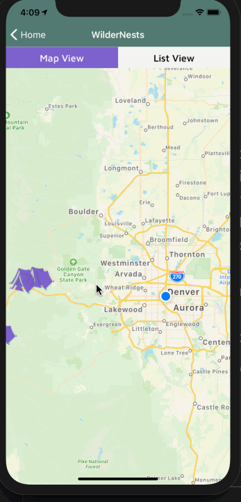
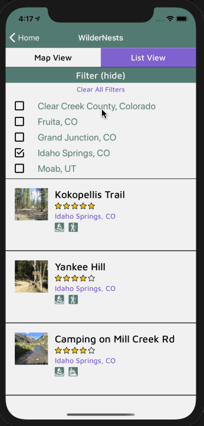
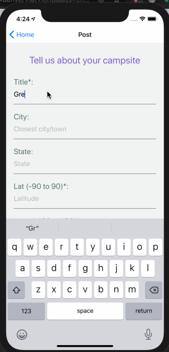

  

  <h3 align="center">WilderNests</h3>

  

  WilderNests - A mobile app to find or post dispersed campsites in the United States. Giving adventurous campers peace of mind by providing community vetting in the back country.
  

## Table of Contents
1. [Summary](#summary)
2. [Getting Started](#getting-started)
    * [Prerequisites](#prerequisites)
    * [Installation](#installation)
3. [Technologies Used](#technologies-used)
4. [Future Extensions](#future-extensions)
5. [Contributors](#contributors)

## Summary
This app was created with the goal of providing users with a pleasant experience of finding, posting, rating, and reviewing dispersed campsites. Users can upload a photo, add a title, location, description, driving tips and available activities in the area. Users can leave comments and ratings for other campsites. The app makes use of a custom database to store information. You can click [here](https://github.com/Turing-Cross-Pol/DispersedCamping_BE) to learn more about the back end.

## Getting Started
To get this project up and running on your local environment, follow the steps below:

### Prerequisites
1. Install the Expo CLI `npm install -g expo-cli`
2. Install the [Expo](https://expo.io/) client app on your iOS or Android phone and connect to the same wireless network as your computer. On Android, use the Expo app to scan the QR code from your terminal to open your project. On iOS, use the built-in QR code scanner of the Camera app.

### Installation
1. Clone down this repo
2. CD into directory
3. Install all dependencies: `npm install`
4. Start up the Expo server: `expo start`
5. In the window that opens up in your browser, click `run on IOS simulator`
  - Or download the Expo App from the apple store on your phone. If you are connected to the same network, you can scan the QR code to get started or open the Expo and select the Project.
6. Browse the app.

## Technologies Used
- React Native
- React Native Testing Library
- Jest
- React-Native-Maps

## Future Extensions
1. Build out the ability for the app to work with Users
2. Add transition effects for improved UX.
3. Users can add campsites to a list of favorites

## Contributors
- [Lili Manrique - FE](https://github.com/lmanriq)
- [Harry Borrelli - FE](https://github.com/hborrelli1)
- [Nathan Keller - BE](https://github.com/nkeller1)
- [Harry Borrelli - BE](https://github.com/willkunz13)

